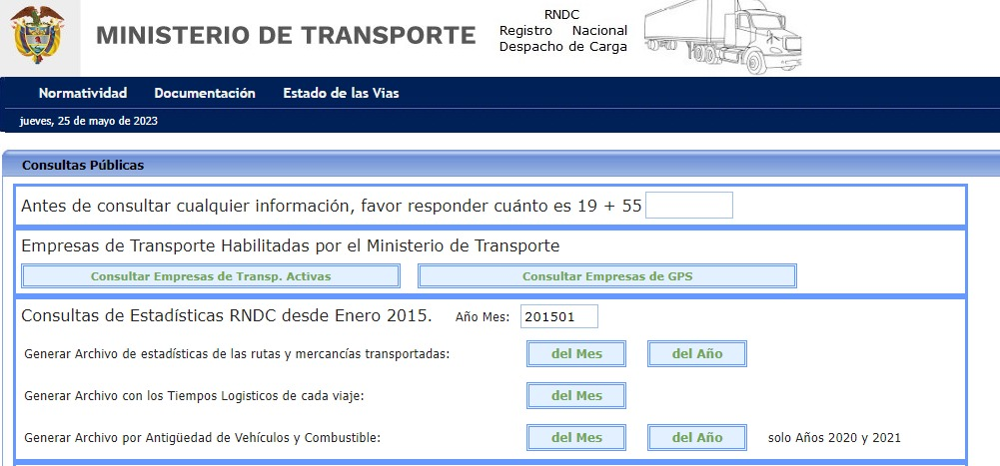

# Arquitectura de AWS para procesamiento de datos del RNDC

## Objetivo: 

Diseñar e implementar una arquitectura en AWS que permita la carga, limpieza y disponibilidad de los datos públicos encontrados en la página del RNDC (Registro Nacional Despacho de Carga) del Ministerio de Transporte de Colombia.

## Alcance:

El proyecto planteado cubre desde la extracción de las diferentes fuentes de datos en local hasta su cargue, transformación y disponiblización en los servicios de AWS (S3, Lambda, Glue y Redshift).

## Etapas:

* Extracción de datos: crear un mecanismo para obtener diferentes fuentes de datos de manera automática.

* Almacenamiento y carga: diseñar e implementar una infraestructura en AWS que permita cargary almacenar los datos de manera automática luego de su descarga.

* Limpieza y transformación: implementar un proceso de limpieza y transformación de datos para asegurar la calidad y coherencia de los mismos.

* Disponibilidad y acceso: Establecer mecanismos para que los datos estén disponibles para su consulta.

## Casos de uso:

 Una vez completado el proyecto, la arquitectura implementada permitirá a diferentes procesos y equipos acceder y utilizar los datos del RNDC para visualización, análisis y modelado. Estos datos podrán ser utilizados para generar información valiosa, informes, visualizaciones o incluso alimentar modelos de aprendizaje automático y toma de decisiones estratégicas en el ámbito del transporte en Colombia. Los análisis y/o modelos derivados del uso de estos datos puede tener como foco temas como los siguientes:

* Valores pagados.
* Tiempos logísticos promedio.
* Orígenes y destinos con mayor participación en movimiento de carga.
* Tipos de flota.
* Corredores desbalanceados (con diferencias sustanciales entre la carga de entrada y la carga de salida).

## Estructura del repositorio:

blablabla

## Exploración de archivos:

### Contexto de los archivos:

Los archivos públicos que se utilizan en el proyecto son descargados a través de:

* Generar Archivo de estadísticas de las rutas y mercancías transportadas - opción mensual - xlsx.
* Generar Archivo con los Tiempos Logisticos de cada viaje - opción mensual - txt.
* Generar Archivo por Antigüedad de Vehículos y Combustible - opción anual - xlsx.

Desde este punto en adelante se hará referencia a estos archivos de manera colectiva como "fuentes de datos" y de manera individual de la siguiente manera:

* Estadísticas: estadisticas 
* Tiempos logísticos: tiempos_logisticos
* Vehículos y combustible: vehiculos_y_combustible

En la siguiente imagen se puede ver la interfaz de usuario para la descarga de los archivos.

### Obtención de los archivos:

Los archivos se hacen disponibles una vez al mes (excepto el de vehiculos_y_combustible), sin una fecha específica de disponibilidad (usualmente en las primeras dos semanas del mes). Para obtener una cantidad de archivos suficientes con la cual cumplir la restricción de un dataset con más de un millón de registros se opta por descargar 10 periodos de tiempo desde el mes inmediatamente anterior.

Para hacer la descarga de los archivos se crea un robot en Python usando la librería Selenium que tiene como parámetro la cantidad de peridos solicitados. El script que realiza esta acción se encuentra en la ruta src/data/download_rndc_files.py.

### Exploración de los archivos:

El proceso de exploración de datos se dividió en tres etapas: conocer la estructura de los archivos, identificar posibles validaciones de datos, aplicar transformación de datos. Todo lo anterior a nivel local, en notebooks, sin modificar los archivos descargados y para cada fuente de datos.

Los notebooks con el detalle de las etapas y los resultados se encuentran en la ruta notebooks/. De manera general se realizan los siguientes procesos para cada fuente de datos:

* Validar que todos los archivos mantienen el mismo esquema.
* Definir campos redundantes. Por ejemplo: existe el campo "COD_CONFIG_VEHICULO" (código tipo str) y "CONFIG_VEHICULO" (descripción del código) ambos haciendo referencia al mismo atributo, en este y los demás casos se opta por no tener en cuenta la descripción para temas de transformación. Nota: Como se verá más adelante estos campos pasan a ser parte de las tablas de dimensiones del modelo entidad-relación.
* Identificar tipos de datos para cada columna de los archivos.
* Validar que todos los archivos son del mismo tipo.
* Validar coherencia de los datos de los archivos. En este caso se valida si los valores contenidos en el campo de periodo corresponden al periodo incluido en el nombre del archivo.
* Transformar los datasets para:
    * Eliminar duplicados (en este caso los registro duplicados son un error debido a que los datos ya se encuentran agregados).
    * Aplicar el tipo de dato a cada columna.
    * Convertir en mayúsculas todo campos tipo str.
    * Reemplazar caracteres con tilde.
    * Cambiar nombre de columnas.

Tener en cuenta que en el caso de las transformaciones, estas no son todas las que se aplican en el proceso final.

# Fuentes:
* Documentación Boto3: https://boto3.amazonaws.com/v1/documentation/api/latest/index.html